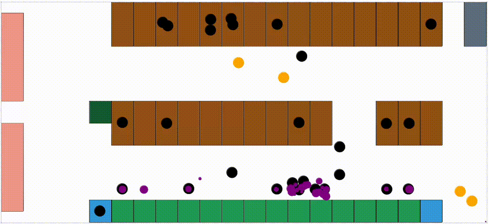

<p align="center">
  <h1 align="center">Simple Task Allocation of Manure
Removing Robots for Cleaning
Optimization.</h1>
  <p align="center">
    <strong>Luis Angel Ponce Pacheco</strong>
  </p>
</p>


<h3 align="center">

  

</h3>


## Installation


### Clone the repository

```
git clone https://github.com/Luis-PP/Simple-Task-Allocation-Manure-Robot.git
```

### Python packages

Quick install:
```
cd ROBOT_COW_INTERACT
conda env create -f environment.yml
conda activate robot_cow_env
```
Manual install:
```
conda create -n robot_cow_env python=3.12.2 -c conda-forge
conda activate robot_cow_env
conda install -c conda-forge geopandas=0.14.3
conda install -c conda-forge matplotlib-base=3.8.3
conda install -c conda-forge numpy=1.26.4
conda install -c conda-forge pandas=2.2.1
conda install -c conda-forge seaborn=0.12.2
conda install -c conda-forge shapely=2.0.3
pip install extremitypathfinder==2.7.0
pip install matplotlib-inline==0.1.6
pip install mesa==2.2.4
```


## Execute

For visualization:
```
python run.py
```

For the sensitivity analysis:
```
python run.py
```